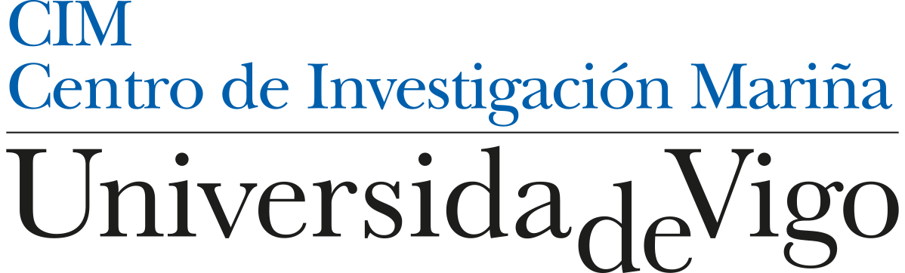

# SeaSondeR

<!-- badges: start -->
[](https://github.com/GOFUVI/SeaSondeR/actions/workflows/R-CMD-check.yaml)
<!-- badges: end -->

The goal of SeaSondeR is to provide a comprehensive set of tools for processing and analyzing data from the SeaSonde(R) High-Frequency Radar (HF-Radar) instrument. This package is intended to facilitate the creation of radial metrics files from spectra data. SeaSondeR is an R package developed as an open-source alternative to proprietary tools for processing HF-Radar spectra and generating Radial Metrics. SeaSondeR integrates all key processing steps into a single workflow, reading and processing both spectrum (CS) files and SeaSonde(R) antenna patterns, identifying the first-order spectral region according to CODAR methodology, and applying the MUSIC algorithm to estimate signal arrival directions. Drawing on technical manuals, patent literature, and prior scientific work, SeaSondeR is designed for both experimental and synthetic data, facilitating cloud-based analyses of extensive HF-Radar datasets while promoting free software solutions in operational oceanography and coastal monitoring.

## Installation

You can install the development version of SeaSondeR from [GitHub](https://github.com/) with:

``` r
# install.packages("devtools")
devtools::install_github("GOFUVI/SeaSondeR")
```


## Package pages

https://gofuvi.github.io/SeaSondeR/

## Acknowledgements

This work has been funded by the HF-EOLUS project (TED2021-129551B-I00), financed by MICIU/AEI /10.13039/501100011033 and by the European Union NextGenerationEU/PRTR - BDNS 598843 - Component 17 - Investment I3. Members of the Marine Research Centre (CIM) of the University of Vigo have participated in the development of this repository.

## Disclaimer

This software is provided "as is", without warranty of any kind, express or implied, including but not limited to the warranties of merchantability, fitness for a particular purpose, and noninfringement. In no event shall the authors or copyright holders be liable for any claim, damages, or other liability, whether in an action of contract, tort, or otherwise, arising from, or in connection with the software or the use or other dealings in the software.

## Trademark Notice

SeaSonde(R) is a trademark of CODAR Ocean Sensors Ltd.

---
<p align="center">
  <a href="https://next-generation-eu.europa.eu/">
    
  </a>
  <a href="https://planderecuperacion.gob.es/">
    
  </a>
  <a href="https://www.aei.gob.es/">
    
  </a>
  <a href="https://www.ciencia.gob.es/">
    
  </a>
  <a href="https://cim.uvigo.gal">
    
  </a>
  <a href="https://www.iim.csic.es/">
    
  </a>
  

  
</p>